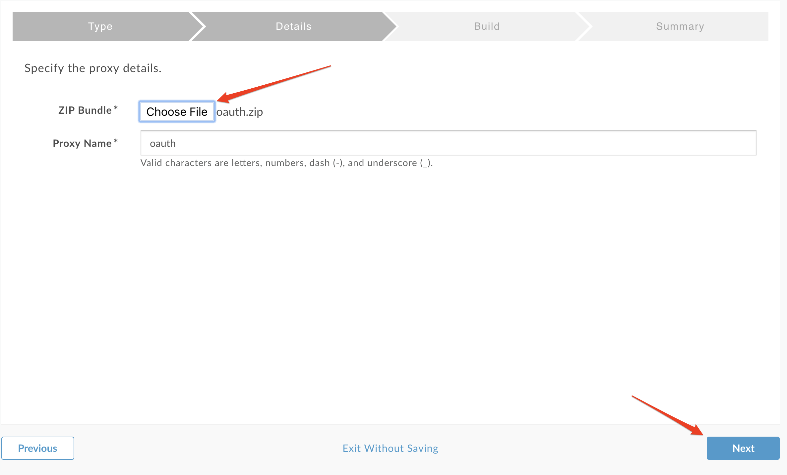
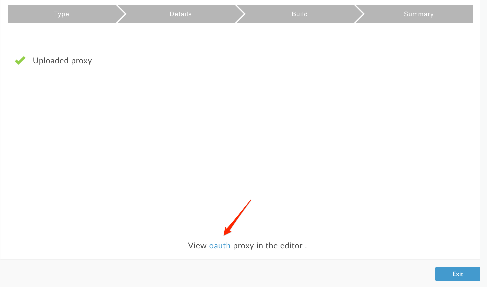
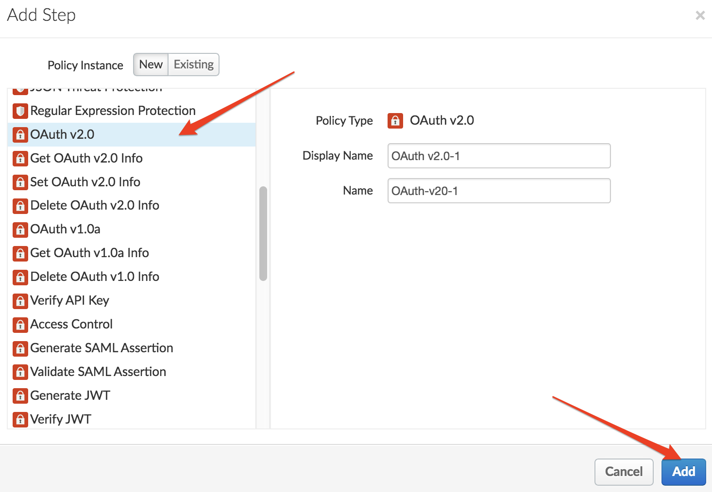

# API Security : Securing APIs with OAuth (2-legged) 

*Duration : 30 mins*

*Persona : API Team/Security*

# Use case

You have an API that is consumed by trusted applications. You want to secure that API using two legged OAuth (client credentials grant type). 

# How can Apigee Edge help?

Apigee Edge quickly lets you secure your APIs using out of the box OAuth policies. OAuth defines token endpoints, authorization endpoints, and refresh endpoints. Apps call these endpoints to get access tokens, to refresh access tokens, and, in some cases, to get authorization codes. These endpoints refer to specific OAuth 2.0 policies that execute when the endpoint is called. 

Most typically, the client_credentials grant type is used when the app is also the resource owner. For example, an app may need to access a backend cloud-based storage service to store and retrieve data that it uses to perform its work, rather than data specifically owned by the end user. This grant type flow occurs strictly between a client app and the authorization server. An end user does not participate in this grant type flow. In this flow, Apigee Edge is the OAuth authorization server. Its role is to generate access tokens, validate access tokens, and pass authorized requests for protected resources on to the resource server.

# Pre-requisites

* Download the [Apigee proxy that impelments OAuth client credentiasls grant type.](./oauth.zip)

* You have an API Proxy that is not currently secured.  If you do not have an API Proxy available for this lab, revisit the lab *API Design : Create a Reverse Proxy with OpenAPI Specification*.

* You have the following created on Apigee Edge - an API Product, a Developer and an App. If not, jump back to *API Security : Securing APIs with API Key* lab.

# Instructions

* Go to [https://apigee.com/edge](https://apigee.com/edge) and log in. This is the Edge management UI. 

* Select **Develop → API Proxies** in the side navigation menu

	

* Click on the API proxy that you created in *Create a Reverse Proxy with OpenAPI Specification* lab. 

* Click on the **Develop** tab. Select **PreFlow** from the sidebar under **Proxy Endpoints** section.

	

	

* Click on Add Step and in the dialog, select **OAuth v2.0** from the Security section then click the **Add** button.

	

* Click on the policy and in the code editor, paste the code give below

```
<?xml version="1.0" encoding="UTF-8" standalone="yes"?>
<OAuthV2 async="false" continueOnError="false" enabled="true" name="OAuth-v20-1">
     <DisplayName>OAuth v2.0-1</DisplayName>
     <ExternalAuthorization>false</ExternalAuthorization>
     <Operation>VerifyAccessToken</Operation>
     <SupportedGrantTypes/>
     <GenerateResponse enabled="true"/>
</OAuthV2>
```

* Once again click on Add Step and in the dialog, select **Assign Message** policy from the Mediation section then click the Add button.

	

* Click on the policy and in the code editor, paste the code give below

```
<?xml version="1.0" encoding="UTF-8" standalone="yes"?>
<AssignMessage async="false" continueOnError="false" enabled="true" name="Assign-Message-1">
<DisplayName>Assign Message-1</DisplayName>
<Remove>
   <Headers>
      <Header name="Authorization"/>
   </Headers>
</Remove>
<IgnoreUnresolvedVariables>true</IgnoreUnresolvedVariables>
<AssignTo createNew="false" transport="http" type="request"/>
</AssignMessage>
```

Note: You’ll have to remove the Authorization header using the Assign Message policy because, the header might create a conflict in the target backend.

* **Save** the proxy and deploy it on the **test** environment.

	

* *Congratulations!*...You’ve now successfully secured your APIs with OAuth 2.0.

* Now, let’s test it. To do that, we’d have to obtain the consumer key and secret for a particular app that is associated with a API Product containing the APIs that we created.

* Click **Publish > Apps** from the side navigation menu.

	

* Select the app that you created in the *API Security : Securing APIs with API Key* lab.

	

* Click on the show button under Consumer Key and Consumer Secret.

* Copy the values and store them somewhere safe.

	

* Mac and Linux users, open Terminal and type the following command

```
	echo -n <consumer_key>:<consumer_secret> | base64
```

If you are using Windows, refer this [link](https://www.base64encode.org/) to generate the value.

* Now, let’s test the deployment using the [REST Client](https://apigee-rest-client.appspot.com/). Open the REST Client on a new browser window.  

* Copy the URL for oauth API proxy. 

	

* First, you’ll obtain an access token which will be used while fetching the employees list. To obtain an access token, you’ll have to make a POST request to the /oauth/client_credential/accesstoken endpoint with a client credentials grant type as a query param and an Authorization header which is the base64 encoded value of consumer key and secret pair that was obtained previously.

	Query param: 
  ```
  grant_type=client_credentials
  ```
  
	Header: 
  
  ```
  Authorization: Basic <base64 encoded value>
  ```

	

* Hit **Send** and you should see a response like this below. Then, copy the value for access token.

	

* Now, you should be able to get the employees list using the access token that we just obtained. Copy the URL for the proxy you created earlier in this lab.

	

* Paste the URL in the Rest client, add the Authorization header and send a **GET** request . The value for Authorization header will be the access token that we obtained previously.

```
Authorization: Bearer {access_token}
```


* Hit **Send** and you should see a response like this below. 

	

* And, if you remove the Authrorization header and hit send, you will see a 401 Unauthorized status.

	

# Lab Video

If you are lazy and don’t want to implement this use case, it’s OK. You can watch this short video to see how to implement 2 legged OAuth on Apigee Edge [https://youtu.be/0pah5J7yQTQ](https://youtu.be/0pah5J7yQTQ) 

# Earn Extra-points

Now that you’ve learned how to secure your API with OAuth 2.0, try to control the expiry of the access token that is generated.

# Quiz

1. What are the various OAuth 2.0 grant types supported by Apigee Edge?

2. What are the various operations that are provided by the OAuth v2.0 policy?

# Summary

In this lab you learned how to secure your API using a two legged OAuth by using the default oauth proxy obtaining an access code and using that against your API.

# References

* Link to Apigee docs page

    * OAuth 2.0: Configuring a new API proxy [http://docs.apigee.com/api-services/content/understanding-default-oauth-20-configuration ](http://docs.apigee.com/api-services/content/understanding-default-oauth-20-configuration)

    * Secure an API with OAuth [http://docs.apigee.com/tutorials/secure-calls-your-api-through-oauth-20-client-credentials](http://docs.apigee.com/tutorials/secure-calls-your-api-through-oauth-20-client-credentials) 

* [Link](https://community.apigee.com/topics/oauth+2.0.html) to Community posts and articles with topic as "OAuth 2.0" 

* Search and Revoke tokens - [https://community.apigee.com/articles/1571/how-to-enable-oauth-20-token-search-and-revocation.html](https://community.apigee.com/articles/1571/how-to-enable-oauth-20-token-search-and-revocation.html)

# Rate this lab

How did you link this lab? Rate [here](https://drive.google.com/open?id=1L95jU79wmOP-rHVY2Laba8lApZpS-yztwdONz0nCzWs).

